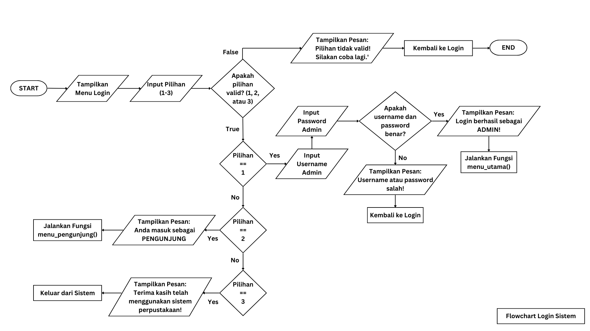

# Capstone_Modul1
Python Fundamental_Modul 1_Purwadhika Project
# Perpustakaan Digital - Taman Ismail Marzuki

📖 Deskripsi
Program ini merupakan sistem manajemen perpustakaan berbasis Python yang memungkinkan pengguna untuk:
- Melihat daftar buku berdasarkan kategori atau judul
- Menambahkan buku ke dalam wishlist
- Meminjam dan mengembalikan buku
- Mengelola koleksi buku (hanya untuk admin)
- Menghapus serta mengembalikan buku yang telah dihapus dari recycle bin

Program ini memiliki dua mode akses: **Admin** dan **Pengunjung**.

📌 Fitur Utama
1. Akses Pengunjung
- Melihat daftar buku: Pengguna dapat mencari buku berdasarkan judul, kategori, atau melihat seluruh koleksi.
- Wishlist buku: Pengguna dapat menambahkan buku yang tidak tersedia ke dalam wishlist mereka.
- Melihat wishlist: Pengguna dapat mengecek daftar wishlist mereka dan menghapus buku dari wishlist jika diinginkan.

2. Akses Admin
- Menambah buku: Admin dapat menambahkan buku baru ke dalam koleksi perpustakaan.
- Menghapus buku: Admin dapat menghapus buku yang akan disimpan ke dalam recycle bin.
- Memulihkan buku: Admin dapat mengembalikan buku yang telah dihapus dari recycle bin ke dalam koleksi.
- Meminjamkan buku: Admin dapat mencatat peminjaman buku oleh pengguna.
- Mengembalikan buku: Admin dapat mencatat pengembalian buku, serta mengecek keterlambatan dan menerapkan denda jika diperlukan.
- Melihat daftar peminjam: Admin dapat melihat daftar pengguna yang sedang meminjam buku.

 🚀 Cara Menjalankan Program
1. Pastikan Python telah terinstal di perangkat Anda.
2. Instal pustaka yang dibutuhkan dengan menjalankan perintah:
   ```cmd
   pip install pwinput python-dotenv tabulate colorama
   ```
3. Jalankan program dengan perintah:
   ```cmd
   python Semangat_Capstone_Python.py
   ```
4. Pilih mode akses:
   - Admin: Masukkan username dan password admin untuk mengakses fitur manajemen perpustakaan.
   - Pengunjung: Langsung mengakses menu pengunjung untuk melihat dan mencari buku.

 🔑 Kredensial Admin
- Username: `adminTIM`
- Password: Tersimpan dalam file `.env` dengan variabel `ADMIN_PASSWORD`.

 🛠 Teknologi yang Digunakan
- Python: Bahasa pemrograman utama.
- pwinput: Untuk input password dengan keamanan lebih baik.
- dotenv: Untuk mengelola kredensial admin secara aman.
- tabulate: Untuk menampilkan tabel secara lebih rapi.
- colorama: Untuk memberikan warna pada output terminal.
- os, re, datetime: Modul bawaan Python untuk manajemen file, regex, dan tanggal.

 📌 Catatan Tambahan
- Pastikan file `.env` telah dikonfigurasi dengan benar untuk menyimpan password admin.
- Program ini menggunakan pendekatan berbasis terminal dan belum memiliki antarmuka grafis.

 📞 Kontak
Jika ada pertanyaan atau masalah, silakan hubungi pengembang.

---

**Selamat menggunakan sistem perpustakaan ini! 📚✨**


